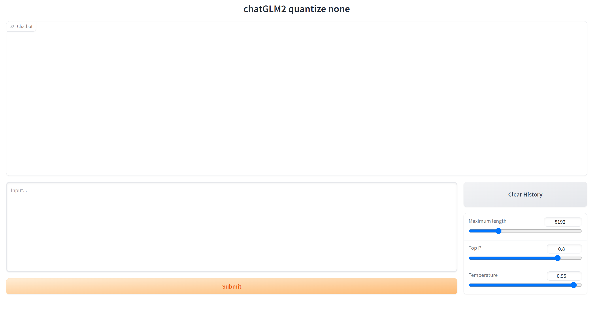

# Train Custom LLM

探索LLM更多有趣的玩法

## 环境

```text
# peft, bitsandbytes拉github repo最新的分支安装
peft==0.4.0.dev0
torch==2.0.0
transformers==4.30.2
bitsandbytes==0.39.1
```

## 微调方式


## 模型运行

直接加载基座模型启动

```shell
CUDA_VISIBLE_DEVICES=0 python.py webui.py --model {模型类型如 baichuan, chatGLM} --model_ckpt {模型权重文件路径}
```

添加lora权重，使用量化方法运行

```shell
CUDA_VISIBLE_DEVICES=0 python.py webui.py --model {模型类型如 baichuan, chatGLM} --model_ckpt {模型权重文件路径} --lora_ckpt {lora权重文件路径} --quantize {4bit, 8bit}
```



## 支持模型类型

- [x] chatGLM1/2
- [ ] baichuan-7B

## Dataset

- https://github.com/LianjiaTech/BELLE


## Reference
- https://github.com/beyondguo/LLM-Tuning/tree/master
- https://github.com/hiyouga/LLaMA-Efficient-Tuning
- https://github.com/yangjianxin1/Firefly/tree/master
- https://github.com/gradio-app/gradio
- https://github.com/imClumsyPanda/langchain-ChatGLM/tree/master


