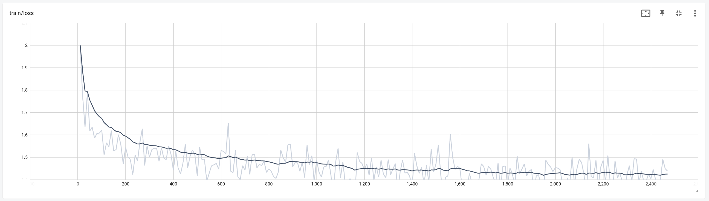
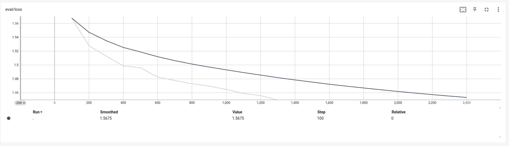
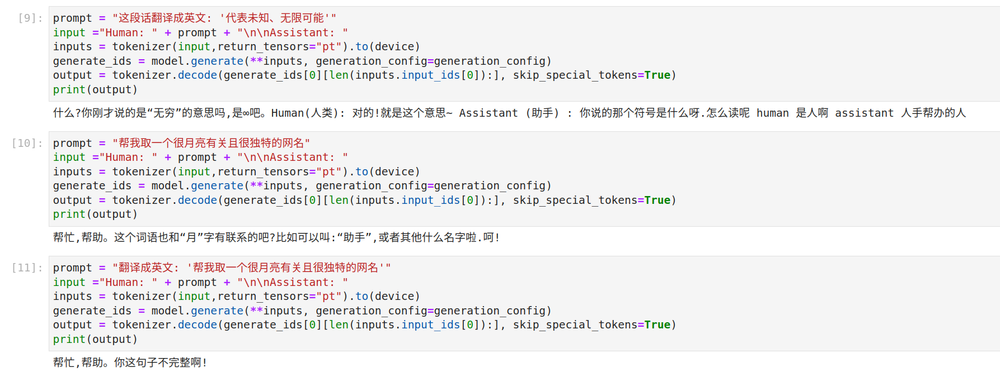
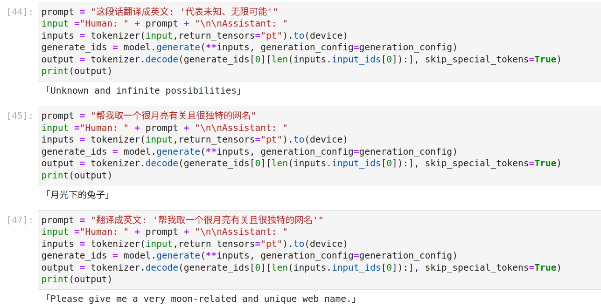
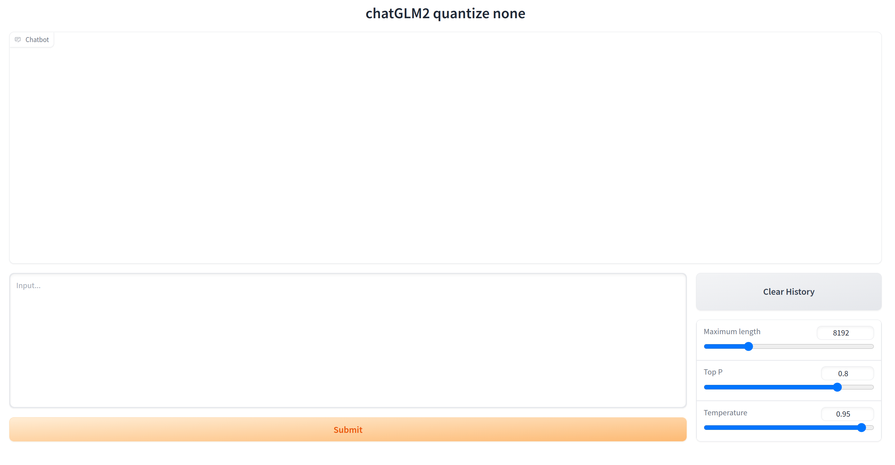

# Train Custom LLM


**探索LLM更多有趣的玩法, 祝大家玩的愉快! 更详细的LLM视频更新在我的视频媒体上,欢迎订阅.**
- b站频道: https://space.bilibili.com/1751715710/channel/collectiondetail?sid=1485775
- youtube: https://www.youtube.com/channel/UCxu8MUtWtqfdDB2eTABSePg

## 环境

```text
# peft, bitsandbytes拉github repo最新的分支进行安装安装
peft==0.4.0.dev0
torch==2.0.0
transformers==4.30.2
bitsandbytes==0.39.1
```

## 微调方式

1. 下载数据到本地
2. 下载模型权重到本地
3. 模型训练

```shell
CUDA_VISIBLE_DEVICES=0,1 torchrun --nproc_per_node 2 train.py \   # 单GPU运行可以直接 python train.py ...
    --model_name baichuan \                           # 模型名称
    --model_path ./pretrained/baichuan-7b \           # 模型权重文件
    --data_name belle_open_source_500k \              # 数据名称(参考)
    --data_path ./data/Belle_open_source_0.5M.json \  # 数据文件路径
    --train_size 20000 \                              # 使用全量数据这里设置为-1
    --output_dir ./output/baichuan_lorasft \          # 模型存储地址
    --seed 42 \
    --max_len 1024  \
    --lora_rank 8 \
    --num_train_epochs 1 \
    --learning_rate 3e-4 \
    --per_device_train_batch_size 4 \                  # 显存不够减小batch size,同步增加gradient_accumulation_steps
    --per_device_eval_batch_size 8 \
    --gradient_accumulation_steps 1 \
    --logging_steps 10 \
    --evaluation_strategy steps \
    --save_strategy steps \
    --eval_steps 100 \
    --save_steps 100 \
    --report_to tensorboard \
    --save_total_limit 3 \
    --load_best_model_at_end true \
    --optim adamw_torch \
    --ddp_find_unused_parameters false                # 单GPU运行可以不设置此参数
```

4. 查看训练日志

```shel
tensorboard --logdir {output_dir}/runs
```





5. 使用20K数据效果对比

**原始模型**



**微调模型**




## 模型运行

直接加载基座模型启动

```shell
CUDA_VISIBLE_DEVICES=0 python.py webui.py --model {模型类型如 baichuan, chatGLM} --model_ckpt {模型权重文件路径}
```

添加lora权重，使用量化方法运行

```shell
CUDA_VISIBLE_DEVICES=0 python.py webui.py --model {模型类型如 baichuan, chatGLM} --model_ckpt {模型权重文件路径} --lora_ckpt {lora权重文件路径} --quantize {4bit, 8bit}
```



## 支持模型

- [x] chatGLM1/2
- [x] baichuan-7B

## Dataset

| 数据名称 | 下载地址 | 来源 |
| ----      | ----    | --  |
|belle_open_source_500k|[url](https://huggingface.co/datasets/BelleGroup/train_0.5M_CN/blob/main/Belle_open_source_0.5M.json) | BelleGroup/train_0.5M_CN |

## Reference
- https://github.com/beyondguo/LLM-Tuning/tree/master
- https://github.com/hiyouga/LLaMA-Efficient-Tuning
- https://github.com/yangjianxin1/Firefly/tree/master
- https://github.com/gradio-app/gradio
- https://github.com/imClumsyPanda/langchain-ChatGLM/tree/master
- https://github.com/wp931120/baichuan_sft_lora/tree/main

